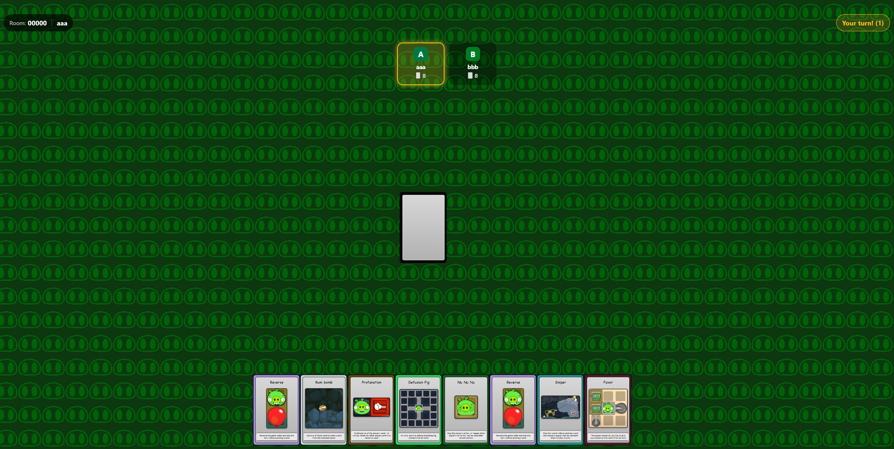

# Exploding Pigs

**Exploding Pigs** is a client-server card game working on few-digits code rooms



- [Installing](#Installing)
- [Loading](#Loading)
- [Authors](#Authors)

## Installing

```shell
cd client
npm install
cd ../server
npm install
```

### Setting development env

- make sure that you have .env file in project main folder (where the /client and /server folders are) with variables CLOUD_URL and GAME_SECRET, e.g.:

```shell
CLOUD_URL=example.app
GAME_SECRET=abc123
```

(if you're running it only in local LAN web, you don't have to give a real working link to the CLOUD_URL variable, but GAME_SECRET is required)

-

```shell
py dev_env.py
```

or

```shell
python dev_env.py
```

(depends of system version)

## Loading

### Server

```shell
cd server
node server.js
```

### Client

```shell
cd client
npx expo start
```

(if you're launch it first time after setting the .env files use those commands instead):

```shell
cd client
npx expo start -c
```

## Authors

- Bartosz Wilczek - [GitHub](https://github.com/angrypigs)
- Igor Mania - [GitHub](https://github.com/ziemniorcee)
- Jakub Kamiński - [GitHub](https://github.com/QBA8QBA)
